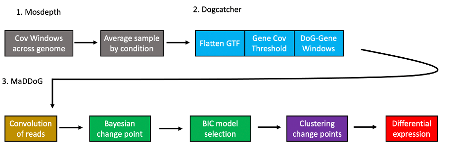

# MaDDoG
Multi analysis of differential expression of downstream of gene regions (MaDDoG), that partitions downstream of gene regions based on changes in read-depth (using a rolling average from a group of samples) with subsequent differential expression analysis of each section (between groups). Importantly, MaDDoG is a tool that can be applied to any area of the genome but is built to primarily classify DoG regions.

1. On a per sample basis reads are binned across the entire genome then grouped by condition taking the average at each window (1. grey). 

2. Dogcatcher is then applied which consists of flattening the annotation to remove overlapping genes, selecting a minimum read depth per gene, and using sliding windows with cutoffs for the end of a gene 

3. After input regions are obtained, MaDDoG first applies a convolution window to smooth reads (brown), applies multiple Bayesian change point analysis models with Bayesian Information Criteria (BIC) to select a model (green), adds all changepoints from both groups and clusters the points (purple), and finally takes the regions sectioned by change points and applies differential expression analysis (red)

## Files needed to run MysterMiner
	DISCLAIMER: Helper scripts to create indexes and download 
	databases are provided in Build_DataBases_Indexes folder 
	but questions on creating indexes and downloading databases are best 
	answered directly from the websites of the programs as methods can 
	change frequently. 

	Below are all of the files you will need to run MysteryMiner
	
	FASTQ files:
	    must be zipped and renamed with name_R1.fastq.gz for single end
	    or name_R1.fastq.gz and name_R2.fastq.gz for paired end
	    
    Sample Table File:
        Tab seperated file to identify conditions of each sample.
        A template has been provided in sample_table.txt.
        (Headerless file and can handle 2+ conditions)        
        (NOTE: File must be called sample_table.txt and in same folder as main.nf)
	
	Mapping Indexes:
	    Host organism indexes created by STAR and Bowtie. 
		
	Databases:
        nt (nucleotide BLASTN) and nr (non-redundant BLASTX) databases

## Virtual environment for tensorflow probability

## Programs (and tested versions) to run MysteryMiner

Programs are imported at the top of each file but listed here for completeness

gcc/7.1.0
fastqc/0.11.8
bowtie/2.2.9
STAR/2.5.2b
ncbi-blast/2.7.1
seqkit/0.9.0

SPAdes-3.13.1-Linux

### Modules and Programs
After creating the databases and preparing the files, 1.0_MysteryMiner_Nextflow.sh is the bash script
that will run the first part of the pipeline.

### Python specific modules

# Part 1. Initial NextFlow for samples (mapping and mosdepth)

Slurm Disclaiimer: MaDDoG was only tested with Slurm but 
should function similalry on other High Performance Computing Clusters 
with different systems that are able to install NextFlow

NextFlow Disclaimer: Knowledge of NextFlow is not needed, but changing filepaths and some parameters inside
of the main nextflow script (main.nf) is necessary as they would not work properly when used as main input parameters in 
1.0_Prepare_samples/initial_nextflow/main.nf

Additionally, users are encouraged to check each nextflow step in main.nf to set the max_forks (amount of max threads at each step), 
cpus for each step, or swap out trimmers/aligners or add steps so you can design the pipeline to suit your needs.

## Programs needed for part 1

    sra/2.8.0
    samtools/1.8
    hisat2/2.1.0
    bedtools/2.25.0
    fastqc/0.11.8
    bbmap/38.05
    igvtools/2.3.75

## File input

    Fastqs from samples (must end in R1.fastq or R1/R2.fastq for paired end
    genome and chrom sizes
    
## Running

    Run nextflow_RNAseq.sh to run the main.nf ffile
    
## Output

    In your OUT directory therre will be a mapped folder
    This will output mapped bams, bedd files, and mosdepth files
    It will also outout library sizes for normalization

    Use the mapped reads to create a library normalization file similar to the Sample_Table.tsv example
    Keep all conditions C or T to ensure all downstream scripts work    

## mosdepth

    Run the NormalizeMosdepth jupyter notebook after creating your library sizes file. This will normalize all your samples and get the average for each group based on the "condition" column in your library sizes file

# Part 2. MaDDoG

    In the Nextflow MaDDoG folder dogcatcher_nextflow_RNAseq.sh is the main script to run

    This will first flatten the file. Run a modified version of Dogcatcher that outputs DoGs in the format for MaDDoG.

    MaDDoG runs with Nextflow in parallel on each chromosome. You can find the CHR_name file after running the flattening script.

    The last part of the main.nf script will create an RSubread script from the segments. Open up the main.nf file and modify the BAMPATH and samples for your experiment.
    
    
    After this, open up the FilterDESeq2 python notebook and give it the path to the Rsubread output.
    
    This will output a BED folder and a csv with significant segments.